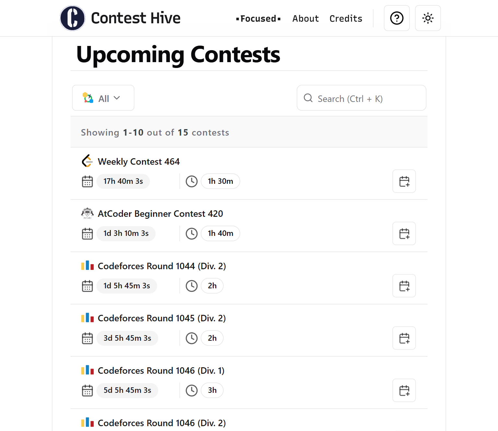

I found out today`(23/08/2025)` that **StopStalk** is discontinued.

StopStalk had a lot of features -- profiles, ranking, showing upcoming contests and so on.

> So is everything gone now?

Well, not **everything**.

I started a project in 2023 to make an API to fetch all the upcoming contests from different platforms. Then I thought, "Why not make a functioning website instead?"

And so I did! **[Contest Hive](https://contest-hive.vercel.app/)**, a website listing all the upcoming contests from the major online judges. It's totally free, open-source, and is more user friendly ( or at least in my opinion `^_^` )

I really suggest you give it a try. And I'd love to hear your feedback, what you like, what you don't, literally **anything** you have to say about it!

> Hehe, promoting my own project huh? `:3`
> Well, it's not **_bad_** !

Here, have a little glance:

